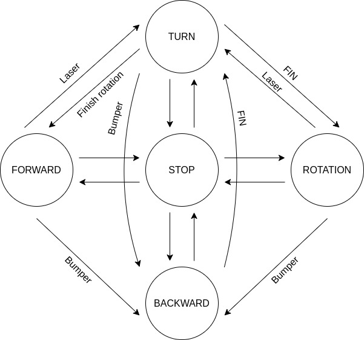
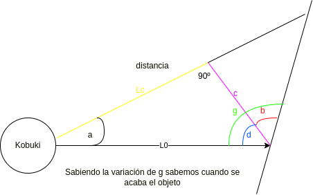
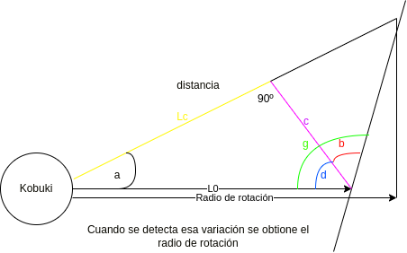
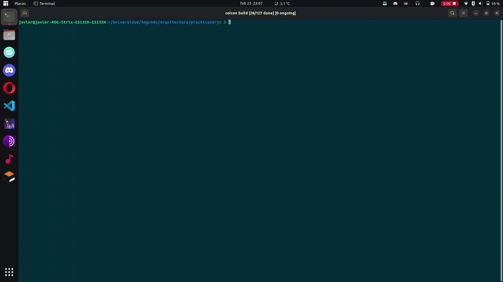
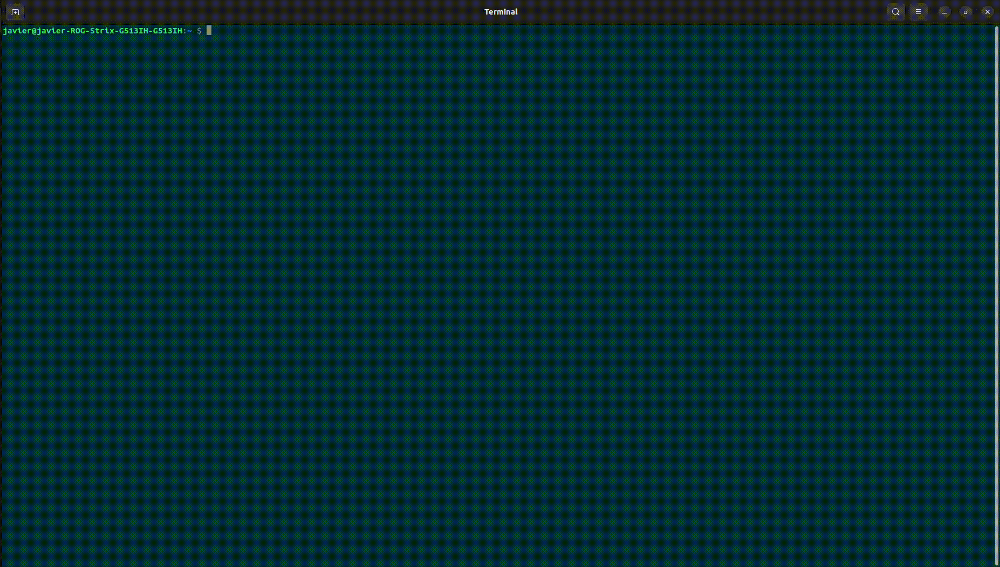

# ASR-0-AvoidObstacle
Práctica 0 - Arquitecturas Software para Robots 2023

Crea un comportamiento autónomo de un robot usando una máquina de estado finito (FSM) para evitar obstáculos:
1. El robot empieza parado, y comienza su comportamiento cuando se pulsa un botón del robot.
2. El robot avanza hasta encontrar un obstáculo a menos de un metro enfrente de él.
3. Cuando encuentra un obstáculo, el robot gira 90 grados, y realiza un movimiento de arco para sobrepasarlo.
4. Si mientras está haciendo el arco, se encuentra un nuevo obstáculo, vuelve a hacer lo mismo del punto 3.


El robot debe funcionar en el robot real Kobuki.

Puntuación (sobre 10):

* +8 correcto funcionamiento en el robot real.
* +2 Readme.md bien documentado con videos.
* -3 Warnings o que no pase los tests.
* +1 Setup de CI/CD

Imágenes:

# Versión 1: Avoid_obstacle

## Contenido multimedia

[VÍDEO]

## Máquina de estados implementada para este modelo



## Características de uso e implementación
* Uso del bumper para la detección de escalones u objetos a los que el lidar no detecte
* Botón de detención y botón de reset
* Parada de emergencia si el kobuki tiene una de sus ruedas en el aire
* Zonas de detección dinámicas de objetos 360º
* Rotación en ambos sentidos
* Interfaz de rviz para visualizar las zonas de detección dinámicas del láser

[rviz](media/rviz.mp4)

* Algoritmo de detección de fin de objeto





* Uso de interfaz de debug en un nodo aparte. Para saber más información sobre la interfaz de debug, vaya al siguiente [repositorio](https://github.com/javizqh/Debug-Interface-Kobuki).

## Instalación
Clone el repositorio a un workspace, recomendamos clonarlo en el workspace de creado para alojar [ir_robots](https://github.com/IntelligentRoboticsLabs/ir_robots).
A continuación, compile el código como se muestra en el video:



```bash
    # Asegurate de estar en el workspace
    colcon build --symlink-install
```

Luego para lanzarlo siga las siguientes instrucciones:



```bash
    # Asegurate de tener el workspace activado
    ros2 launch avoid_obstacle_forocoches avoid_obstacle.launch.py 
```

Si quieres usarlo en el simulador usa:

```bash
    # Asegurate de tener el workspace activado
    # Lanza el simulador en otra terminal
    ros2 launch avoid_obstacle_forocoches avoid_obstacle_sim.launch.py 
    # En otra terminal manda un topic del boton
    ros2 topic pub /events/button kobuki_ros_interfaces/msg/ButtonEvent "button: 1
state: 1" -t 1
```

## Problemas
Durante la práctica hemos tenido problemas al principio para instalar ros2.

Luego, los problemas más importantes han sido los errores obtenidos al usar parametros, por lo que no los hemos podido usar al final.

## Otros
Tenemos hechos más modelos aunque se encuentran incompletos en las carpetas ocultas model-*/