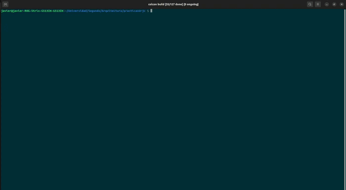

# ASR-0-AvoidObstacle


Práctica 0 - Arquitecturas Software para Robots 2023

Crea un comportamiento autónomo de un robot usando una máquina de estado finito (FSM) para evitar obstáculos:
1. El robot empieza parado, y comienza su comportamiento cuando se pulsa un botón del robot.
2. El robot avanza hasta encontrar un obstáculo a menos de un metro enfrente de él.
3. Cuando encuentra un obstáculo, el robot gira 90 grados, y realiza un movimiento de arco para sobrepasarlo.
4. Si mientras está haciendo el arco, se encuentra un nuevo obstáculo, vuelve a hacer lo mismo del punto 3.


El robot debe funcionar en el robot real Kobuki.

Puntuación (sobre 10):

* +8 correcto funcionamiento en el robot real.
* +2 Readme.md bien documentado con videos.
* -3 Warnings o que no pase los tests.
* +1 Setup de CI/CD

Imágenes:

# Versión 1: Avoid_obstacle

## Contenido multimedia
https://user-images.githubusercontent.com/92941117/221051373-3c27738c-c656-4f15-8bcb-dc93dd8464cc.mp4

## Máquina de estados implementada para este modelo

<p align="center">
     
</p>

## Características específicas de nuestra implementación
* El bumper detectar escalones y otros objetos bajos que el lidar no puede detectar.
* Dos botones especiales: uno de detención y otro de reset.
* Parada de emergencia si el kobuki tiene una de sus ruedas en el aire
* Rotación en ambos sentidos
* Zonas de detección dinámicas de objetos 360º
* Interfaz de rviz para visualizar las zonas de detección dinámicas del láser
 <p align="center">
  
  
 </p>


* Algoritmo de detección de fin de objeto
<p align="center">
  
  
</p>

* Uso de interfaz de debug en un nodo aparte. Para saber más información sobre la interfaz de debug, vaya al siguiente [repositorio](https://github.com/javizqh/Debug-Interface-Kobuki).

## Instalación
Clone el repositorio a un workspace, recomendamos clonarlo en el workspace de creado para alojar [ir_robots](https://github.com/IntelligentRoboticsLabs/ir_robots).
A continuación, compile el código como se muestra en el video:

<p align="center">
    
</p>

```bash
    # Asegurate de estar en el workspace
    colcon build --symlink-install
```

Luego para lanzarlo siga las siguientes instrucciones:

<p align="center">
    
</p>

```bash
    # Asegurate de tener el workspace activado
    ros2 launch avoid_obstacle_forocoches avoid_obstacle.launch.py 
```

Si quieres usarlo en el simulador usa:

```bash
    # Asegurate de tener el workspace activado
    # Lanza el simulador en otra terminal
    ros2 launch avoid_obstacle_forocoches avoid_obstacle_sim.launch.py 
    # En otra terminal manda un topic del boton
    ros2 topic pub /events/button kobuki_ros_interfaces/msg/ButtonEvent "button: 1
state: 1" -t 1
```

## Problemas
Durante la práctica hemos tenido problemas al principio para instalar ROS2 debido a que nadie en el grupo tenía la version de Ubuntu que requería Humble.

Los siguientes problemas serios a los que nos hemos tenido que enfrentar han sido los errores obtenidos al usar parametros. En programas mas pequeños los hemos implementado sin problemas, pero a medida que aumentaba la escala del código y se acercaba la fecha de entrega, se multiplicaban los errores; por lo que al final hemos decidido aplazarlos para otra version.

El último problema que hemos tenido ha sido con un proyecto secundario que buscaba aumentar la funcionalidad del programa usando los 360 grados de rango del lidar y predecir el camino más óptimo para rodear los obstaculos o para pasar entre ellos. Pero este proyecto solo funciona de manera repetible en los simuladores, por lo que tambien ha sido apartado para una futura revisión. (Si tienes curiosidad por este modelo tambien lo tenemos incluido en el repo dentro de una carpeta oculta).
